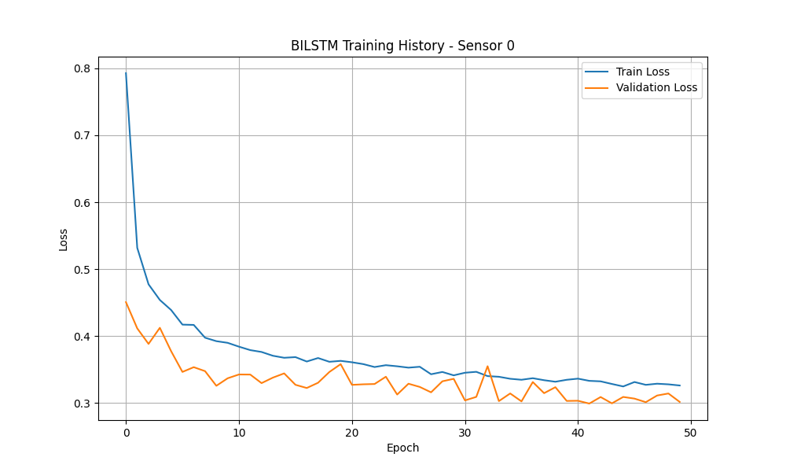
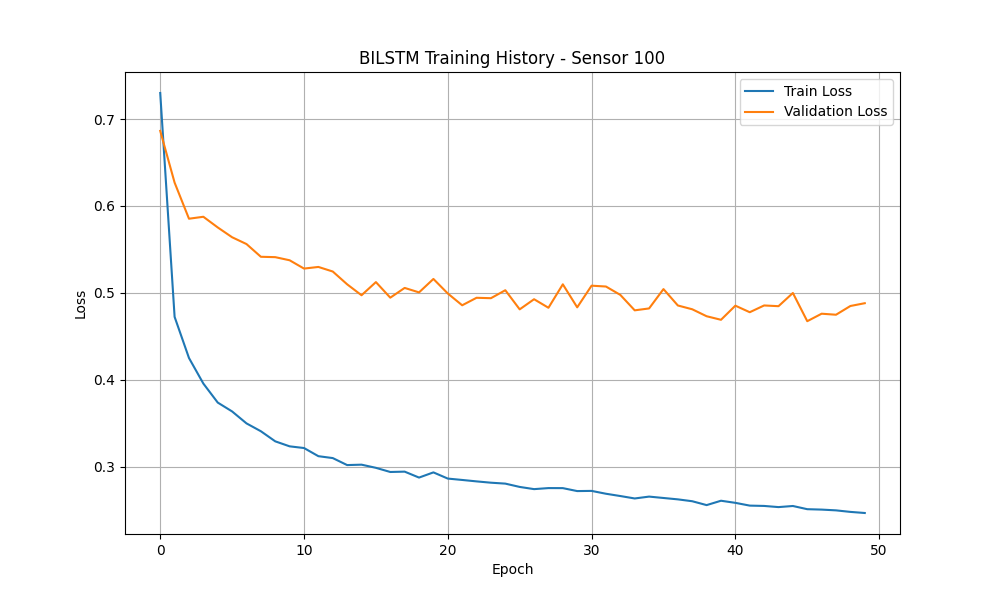
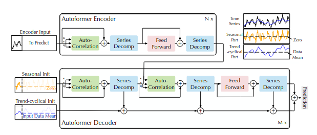

# Simply Model Implementation

## Network Structure

This project implements two recurrent neural network architectures for traffic occupancy prediction:

### 1. GRU (Gated Recurrent Unit)
- **Input size**: 1 (traffic occupancy value)
- **Hidden size**: 64 units
- **Number of layers**: 2 stacked GRU layers
- **Dropout**: 0.2
- **Output**: Single value prediction (next time step occupancy)

The GRU model processes sequential data through:
- GRU layers with batch-first format
- Fully connected output layer mapping hidden states to predictions
- Uses the last time step output for final prediction

### 2. BiLSTM (Bidirectional LSTM)
- **Input size**: 1 (traffic occupancy value)
- **Hidden size**: 64 units (128 bidirectional)
- **Number of layers**: 2 stacked LSTM layers
- **Dropout**: 0.2
- **Bidirectional**: Yes (forward and backward processing)
- **Output**: Single value prediction

The BiLSTM model captures temporal patterns from both directions:
- Bidirectional LSTM layers process sequences forward and backward
- Concatenated hidden states (64 * 2 = 128) feed into output layer
- Uses the last time step output for final prediction

## Dataset

**Traffic Dataset** - California Highway Occupancy Rates

- **Source**: California Department of Transportation
- **Region**: San Francisco Bay Area freeways
- **Time period**: January 2015 - December 2016
- **Frequency**: Hourly measurements
- **Values**: Road occupancy rates (0 to 1)
- **Sensors**: 862 sensors (IDs 0-861)
- **Format**: CSV file with timestamps and sensor readings

The dataset captures traffic patterns across two years, including:
- Daily commute patterns
- Weekly variations
- Seasonal trends
- Holiday effects

## Results

### Training Performance

Training was conducted with the following configuration:
- **Sequence length**: 12 hours
- **Batch size**: 32
- **Epochs**: 50
- **Learning rate**: 0.001
- **Loss function**: Mean Absolute Scaled Error (MASE)
- **Data split**: 70% training, 15% validation, 15% test

#### GRU Model - Sensor 0

The GRU model shows stable convergence with training and validation losses decreasing consistently over epochs.

#### BiLSTM Model - Sensor 0

The BiLSTM model demonstrates similar convergence patterns with slightly different loss curves compared to GRU.

#### BiLSTM Model - Sensor 100

Training on different sensors shows consistent model behavior across various traffic patterns.

### Key Observations

- Both models achieve good convergence without significant overfitting
- Validation loss closely tracks training loss, indicating good generalization
- The models successfully learn temporal patterns in hourly traffic data
- Different sensors exhibit similar training characteristics

# Autoformer

## 1. Core Mathematical Formulas
### 1.1 Time Series Decomposition
- **Trend Component**:  

  $$\mathcal{X}_{trend} = \text{AvgPool}(\text{Padding}(\mathcal{X}))$$

  Where:  
  - $\mathcal{X}$ is the input time series in $\mathbb{R}^{L \times d}$, length $L$$, dimension $d$  
  - `Padding` = symmetric padding (repeating first/last elements)  
  - `AvgPool` = 1D average pooling for smoothing  

- **Seasonal Component**:  
$$ 
  \mathcal{X}_{seasonal} = \mathcal{X} - \mathcal{X}_{trend}
$$

### 1.2 Autocorrelation Mechanism
#### 1.2.1 Autocorrelation Definition  
$$
\text{Autocorrelation}(\tau) = \text{Corr}(y_t, y_{t-\tau})
$$
Where:  
- $y_t$ = value at time $t$  
- $y_{t-\tau}$ = value at time $t-\tau$ (lag $\tau$)  

#### 1.2.2 Frequency-Domain Calculation  
1. FFT transformation:  
 $$
   Q_{fft} = \text{FFT}(Q), \quad K_{fft} = \text{FFT}(K)
$$

## 2. Data Processing Workflow (From Raw Data to Model Input)
Taking the **Traffic Dataset** (hourly road occupancy rates, 862 time series) as an example, the workflow has 4 key steps, outputting PyTorch tensor batches.  

### 2.1 Step 1: Load Meta Dataset
- **Data Content**: Standardized time series with two main fields:  
  - `target`: Numeric sequence (e.g., [0.05, 0.06, ...], range [0,1])  
  - `start`: Start timestamp of the sequence (e.g., "2015-01-01 00:00:00")  
- **Fixed Parameters**:  
  - Prediction length: 24 (forecast next 24 hours)  
  - Context length: 48 (use past 48 hours to predict)  

### 2.2 Step 2: Data Transformation (Preprocessing Pipeline)
Clean and enhance raw data to fit model input requirements:  
1. **Remove Redundant Fields**: Drop unused features (e.g., static categorical features if not needed).  
2. **Format Unification**: Convert `target` and other fields to NumPy arrays.  
3. **Missing Value Handling**:  
   - Fill missing values (NaN) in `target` with 0.  
   - Generate `observed_mask` (boolean array) to mark valid/ missing values.  
4. **Feature Enhancement**:  
   - **Time Features**: Generate periodic features based on frequency (e.g., hour [0-23], weekday [0-6] for hourly data).  
   $$\sin\_feat(x) = \sin\left(\frac{x}{\max\_x} \times 2\pi\right)$$
   $$\cos\_feat(x) = \cos\left(\frac{x}{\max\_x} \times 2\pi\right)$$
   - **Age Feature**: Compute sequence lifecycle info: \(\text{age}_t = \log(t)\) ( \(t\) = time step index, starting from 1).  
5. **Feature Stacking**: Combine time features and age features into a single time-feature matrix.  
6. **Rename Fields**: Map GluonTS-style field names to Hugging Face model inputs (e.g., `target` → `values`).  

### 2.3 Step 3: Instance Splitting (Window Sampling)
Sample "context window + prediction window" from long sequences to simulate forecasting scenarios:  
- **Training Mode**: Randomly sample windows to ensure data diversity.  
- **Validation/Test Mode**: Sample only the last window of the sequence to avoid data leakage.  
- **Output Instance**: Contains "past features" (e.g., `past_values` with length 48) and "future features" (e.g., `future_values` with length 24).  

### 2.4 Step 4: Build DataLoader
Convert sampled instances into PyTorch tensor batches for model training/inference:  
- **Batch Size**: 128 (default in experiments).  
- **Final Tensor Shapes** (univariate scenario):  
  - `past_values`: [128, 48, 1] (batch size × context length × dimension)  
  - `future_values`: [128, 24, 1] (batch size × prediction length × dimension)  
  - Other fields (e.g., `time_features`, `observed_mask`) follow the same batch structure.